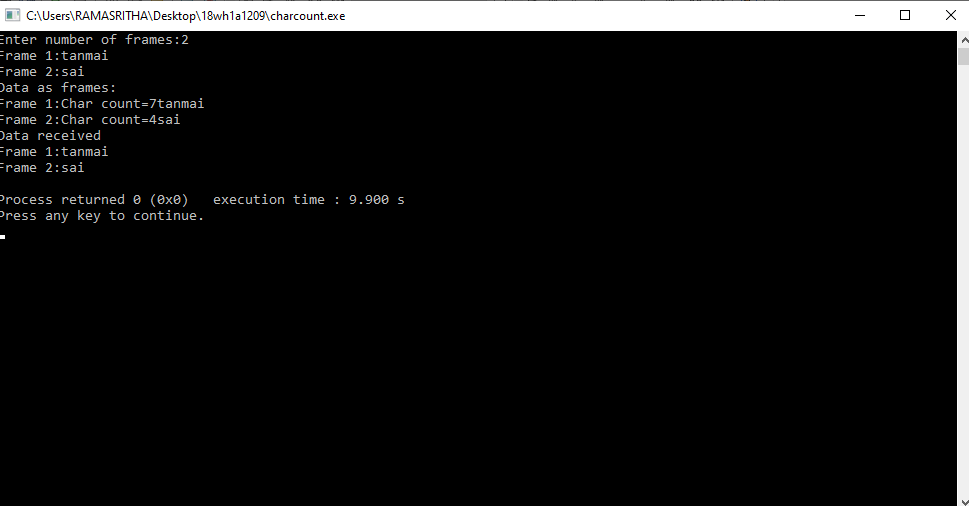
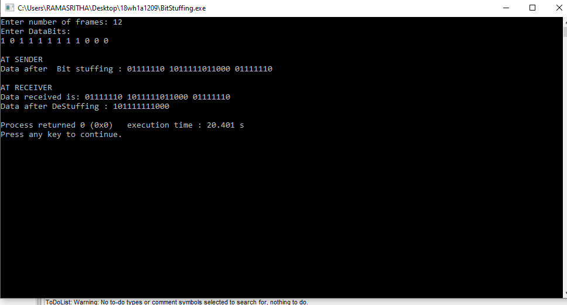
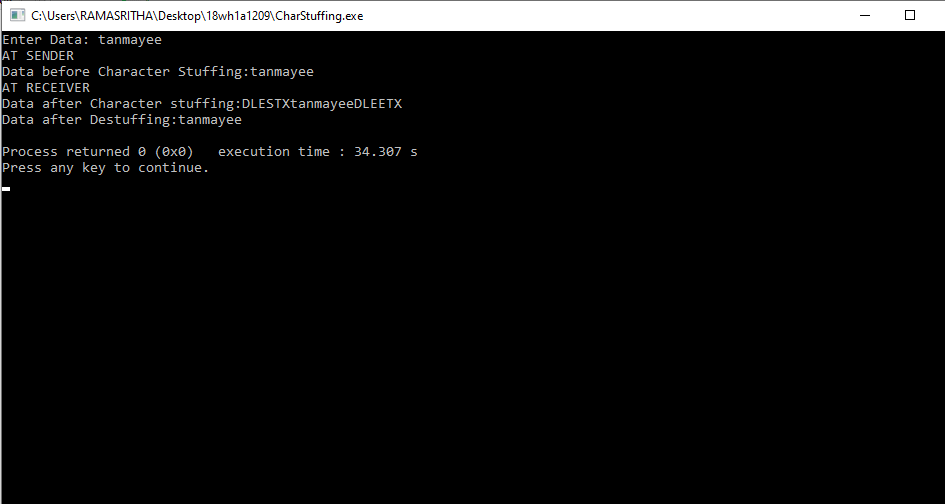

# Experiment 1
## Aim of the Experiment
To implement data link layer framing such as

i.character count ii. character stuffing and iii.bit stuffing

### Step by step procedure of experiment

####Character Count

1.Entering the number of frames required

2.Entering characters in the frames

3.Scan the frames

4.Printing the character count of the frames

5.Printing data recieved

6.Printing frames at the reciever

####Bit Stuffing

1.Assigning i=0 and count=0

2.Entering the number of frames

3.Entering the Data bits

4.Scan the data bits

5.If the bit is 1, then check for four consecutive 1,s

6.If so then stuff a bit 0 at that position

7.Printing data bits after bit stuffing at the sender

8.Printing the data recieved and data after de-stuffing at the reciever

####Character Stuffing

1.Use the two-character sequence DLE STX (Data Link Escape, Start of TeXt) to signal the beginning of a frame, and the sequence DLE ETX (End of TeXt) to flag the frame's end.

2.Use character stuffing within the frame.

3.Replace every occurrence of DLE with the two-character sequence DLE DLE.

4.The receiver reverses the processes, replacing every occurrence of DLE DLE with a single DLE.

### Output

####character count:

####Bit stuffing:

####character stuffing:

