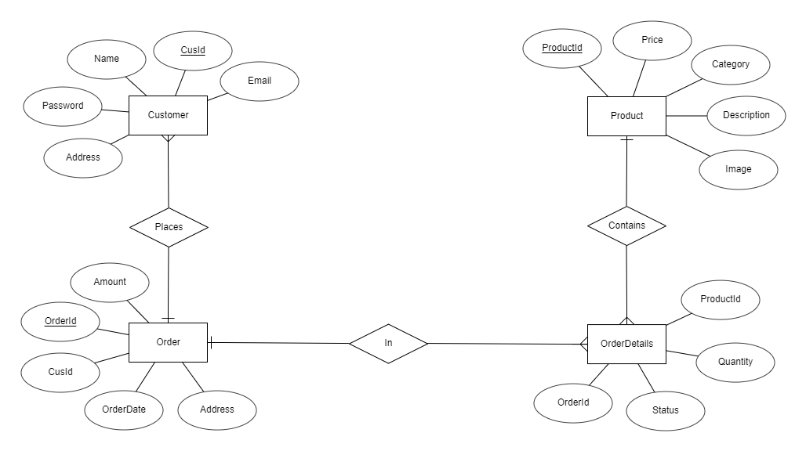

# Experiment 1
## Aim of the Experiment
To implement data link layer framing such as
i.character count ii. character stuffing and iii.bit suffering

### Step by step procedure of experiment
1.Entering the number of frames required
2.Entering characters in the frames
3.Scan the frames
4.Printing the character count of the frames
5.Printing data recieved
6.Printing frames at the reciever

### Output

