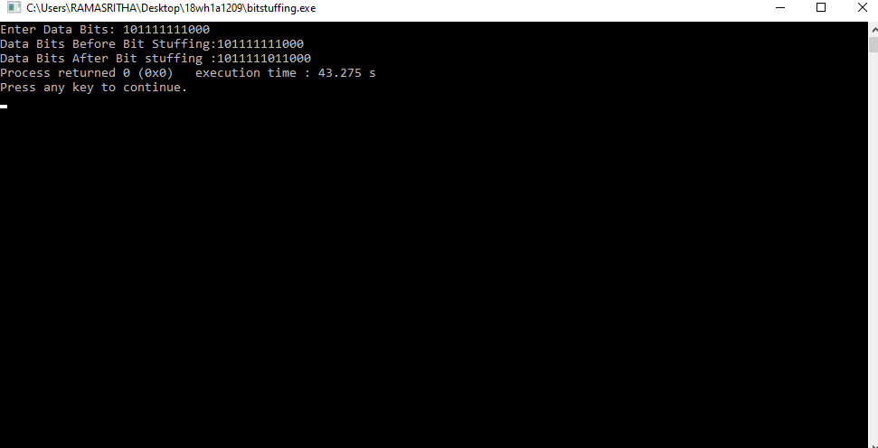

# Experiment 1
## Aim of the Experiment
To implement data link layer framing such as

i.character count ii. character stuffing and iii.bit stuffing

### Step by step procedure of experiment
1.Assigning i=0 and count=0

2.Entering the Data bits

3.Scan the data bits

4.If the bit is 1, then check for four consecutive 1,s

5.If so then stuff a bit 0 at that position 

6.Printing data bits berofe stuffing

7.Printing data bits after stuffing

### Output

